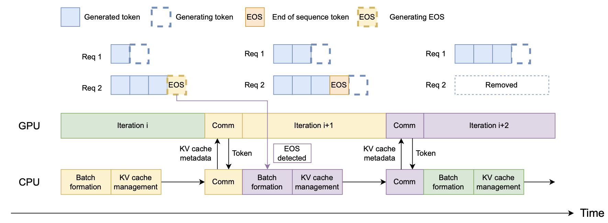
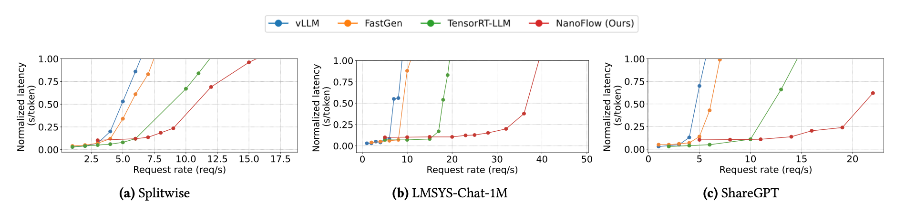
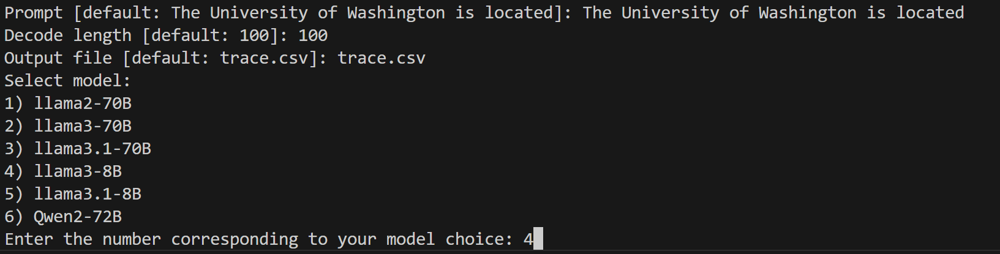

<p align="center">
  
</p>

<p align="center">
  <a href="https://arxiv.org/abs/2408.12757">Paper</a> | <a href="https://github.com/efeslab/Nanoflow">Slides</a>
</p>


NanoFlow is a throughput-oriented high-performance serving framework for LLMs.  NanoFlow consistently delivers superior throughput compared to vLLM, Deepspeed-FastGen, and TensorRT-LLM. **NanoFlow achieves up to 1.91x throughput boost compared to TensorRT-LLM.** The key features of NanoFlow include:

- **Intra-device parallelism**: Maximizes hardware utilization by exploiting nano-batching and execution unit scheduling to overlap different resource demands inside a single device.
- **Asynchronous CPU scheduling**: Achieves highly efficient CPU scheduling by adopting asynchronous control flow for GPU execution, CPU batch formation and KV-cache management.


## News
- [2024/09] 🚀 We supported Llama2 70B, Llama3 70B, Llama3.1 70B, Llama3 8B, Llama3.1 8B and Qwen2 72B models, and released experiment scripts for evaluation results.

## Introduction


The key insight behinds NanoFlow is that traditional pipeline design of existing frameworks under-utilizes hardware resources due to the sequential execution of operations. Therefore, NanoFlow proposes intra-device parallelism (as shown in the following gif), which use nano-batches to schedule the compute-, memory-, network-bound operations for simultaneous execution. Such overlapping leaves compute-bound operations on the critical path and boost the resource utilization.
<p align="center">
  
</p>
<p align="center"><em>Overview of NanoFlow's key components</em></p>

<p align="center">
  
</p>
<p align="center"><em>Illustration of intra-device parallelism</em></p>

With highly utilized GPU, the overhead of CPU, which consists of KV-cache management, batch formation, and retired requests selection, takes significant part ($>10$%) of inference time. Therefore, NanoFlow adopts an asyncronous control flow as shown in the following figure. At any iteration $i$, NanoFlow makes batching decisions and allocates the KV-cache entries for the next iteration before the end of the current iteration. NanoFlow directly launches iteration $i + 1$ without detecting the end-of-sequence (EOS) tokens generated in iteration $i$ and retires completed requests at iteration $i+2$.


<p align="center">
  
</p>
<p align="center"><em>Explanation of asyncronous control flow scheduling</em></p>

To avoid recomputation and reuse the KV-cache from multi-round conversations, NanoFlow eagerly offloads the KV-cache of finished requests to SSDs. In one iteration, NanoFlow selects the KV-cache of the retired requests and copies them to the host in parallel to the on-the-fly inference operations, via a layer-by-layer manner. Our calculation shows that only 5GB/s are needed for the offloading bandwidth of serving LLaMA2-70B, while a single SSD can reach 3GB/s. 

With all mentioned techniques implemented, we now open-source NanoFlow of a Cpp-based backend and a Python-based demo frontend in ~4K lines. NanoFlow integrates state-of-the-art kernel libraries including [CUTLASS](https://github.com/NVIDIA/cutlass) for GEMM, [FlashInfer](https://github.com/flashinfer-ai/flashinfer) for Attention, and [MSCCL++](https://github.com/microsoft/mscclpp) for Network. This codebase also contains necessary scripts for environment setup and experiment reproduction.

## Benchmarks
We list some of the primary benchmarks. Please check our paper for more details. We evaluate on A100 80GB SXM and choose [vLLM v0.5.3](https://github.com/vllm-project/vllm/pull/6696), [Deepspeed-FastGen v0.2.3](https://github.com/microsoft/DeepSpeed-MII/pull/433), and [TensorRT-LLM v0.8.0](https://github.com/NVIDIA/TensorRT-LLM/tree/v0.8.0) as baselines. Note that all frameworks turn off specific optimizations like quantization, speculative decoding, prefix cache, etc..
### Offline throughput: Llama2-70B on 8xA100 (80GB)
We conduct offline througput in two settings: practical workloads from collected traces ([Splitwise](https://arxiv.org/abs/2311.18677), [LMSYS-Chat-1M](https://arxiv.org/abs/2309.11998), [ShareGPT](https://huggingface.co/datasets/anon8231489123/ShareGPT_Vicuna_unfiltered)), and constant input/output length. NanoFlow consistently surpasses all the baselines.

<p align="center">
  
</p>
<p align="center"><em>Offline throughput benchmarks</em></p>

### Online latency: Llama2-70B on 8xA100 (80GB)
We test the normalized latency (which is the end-to-end request latency divided by number of output tokens) with the three real-world traces and set different request rate (incoming requests per second). NanoFlow is able to sustain a higher request rate with low latency compared to baselines among all the datasets.

<p align="center">
  
</p>
<p align="center"><em>Online latency benchmarks</em></p>

### Feasibility: offline throughput on different models
We ported NanoFlow to 5 representative models to showcase its flexibility. We evaluate the offline throughput of NanoFlow (tokens per second per GPU) on these LLMs with constant length of input 1024 and output 512.

<p align="center">
  
</p>
<p align="center"><em>Offline throughput of NanoFlow on different models</em></p>

# Codebase
## Abstract

The increasing usage of Large Language Models (LLMs) has resulted in a surging demand for planet-scale serving systems, where tens of thousands of GPUs continuously serve hundreds of millions of users. Consequently, throughput (under reasonable latency constraints) has emerged as a key metric that determines serving systems’ performance. To boost throughput, various methods of inter-device parallelism (e.g., data, tensor, pipeline) have been explored. However, existing methods do not consider overlapping the utilization of different resources within a single device, leading to underutilization and sub-optimal performance.

We propose NanoFlow, a novel serving framework that exploits intra-device parallelism, which overlaps the usage of resources including compute, memory, and network within a single device through operation co-scheduling. To exploit intra-device parallelism, NanoFlow introduces two key innovations: First, NanoFlow proposes nano-batching to split requests at the granularity of operations, which breaks the dependency of sequential operations in LLM inference and enables overlapping them; then, to get benefit from overlapping, NanoFlow uses a device-level pipeline with execution unit scheduling, which partitions the device’s functional units and simultaneously executes different operations in each unit. NanoFlow automates the pipeline setup using a parameter search algorithm, which enables easily porting NanoFlow to work with different models. We implement NanoFlow on NVIDIA GPUs and evaluate end-to-end serving throughput on several popular models such as LLaMA-2-70B, Mixtral 8×7B, LLaMA-3-8B, etc. We show that NanoFlow achieves 68.5% of optimal throughput. With practical workloads, NanoFlow provides 1.91× throughput boost compared to state-of-the-art serving systems achieving 59% to 72% of optimal throughput across ported models.

## Installation
### Docker setup
```bash
mkdir -p ~/framework-test
docker run --gpus all --net=host --privileged -v /dev/shm:/dev/shm --name nanoflow -v ~/framework-test:/code -it nvcr.io/nvidia/nvhpc:23.11-devel-cuda_multi-ubuntu22.04
```

> If using Runpod, we recommand using pytorch template 2.2.0.

### Install dependencies
```bash
git clone https://github.com/efeslab/Nanoflow.git
cd Nanoflow
chmod +x ./installAnaconda.sh
./installAnaconda.sh
# restart the terminal
```

```bash
yes | ./setup.sh
```

### Serve different models
```bash
./serve.sh
```



## Evaluation

```bash
./perf.sh
```
Result figures can be found in `Nanoflow/pipeline/eval`.


## Citation

If you use NanoFlow for your research, please cite our [paper](https://arxiv.org/abs/2408.12757):
```bibtex
@misc{zhu2024nanoflowoptimallargelanguage,
      title={NanoFlow: Towards Optimal Large Language Model Serving Throughput}, 
      author={Kan Zhu and Yilong Zhao and Liangyu Zhao and Gefei Zuo and Yile Gu and Dedong Xie and Yufei Gao and Qinyu Xu and Tian Tang and Zihao Ye and Keisuke Kamahori and Chien-Yu Lin and Stephanie Wang and Arvind Krishnamurthy and Baris Kasikci},
      year={2024},
      eprint={2408.12757},
      archivePrefix={arXiv},
      primaryClass={cs.DC},
      url={https://arxiv.org/abs/2408.12757}, 
}
```

## Acknowledgement
NanoFlow is inspired by and reuses code from the following projects: [CUTLASS](https://github.com/NVIDIA/cutlass), [FlashInfer](https://github.com/flashinfer-ai/flashinfer), [MSCCL++](https://github.com/microsoft/mscclpp), and [Punica](https://github.com/punica-ai/punica). Development of NanoFlow is made easier thanks to these tools: [GoogleTest](https://github.com/google/googletest), [NVBench](https://github.com/NVIDIA/nvbench), and [spdlog](https://github.com/gabime/spdlog). We thank Siqin Chen for her help in the design of NanoFlow logo.
