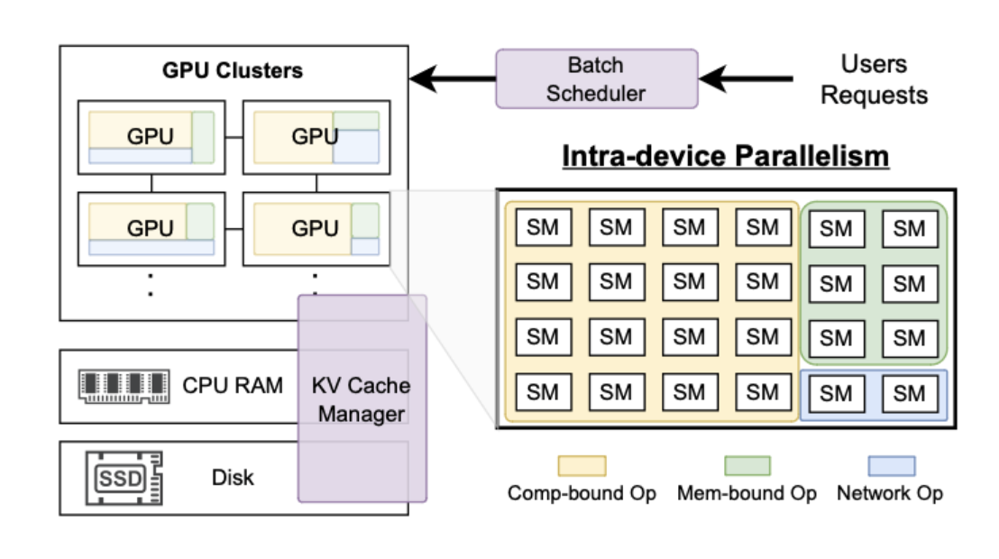
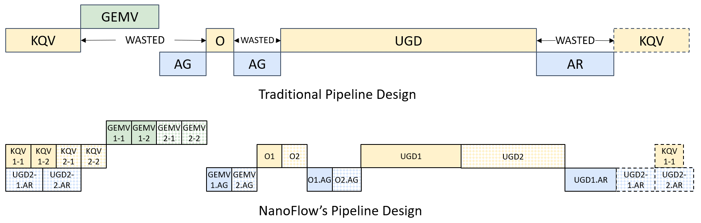
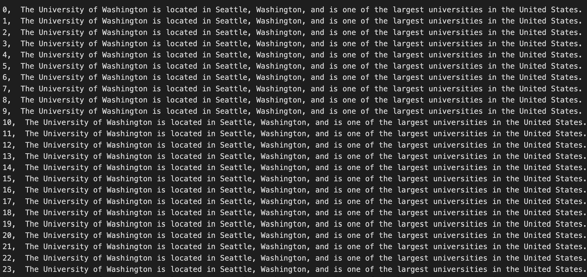
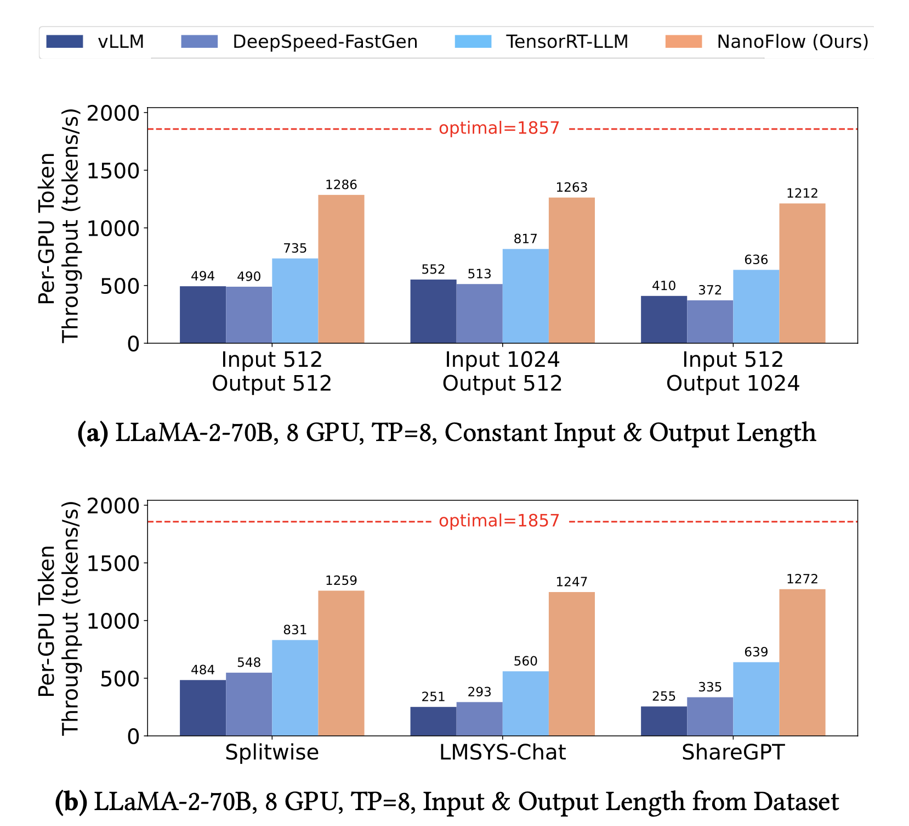

<p align="center">
  
</p>

Nanoflow is a throughput oriented large language model serving framework that overlaps the compute-, memory-, network-bound operations in LLM serving to achieve high GPU utilization. This codebase contains the core pipeline construction and an example serving frontend.  



## Abstract

The increasing usage of Large Language Models (LLMs) has resulted in a surging demand for planet-scale serving systems, where tens of thousands of GPUs continuously serve hundreds of millions of users. Consequently, throughput (under reasonable latency constraints) has emerged as a key metric that determines serving systems’ performance. To boost throughput, various methods of inter-device parallelism (e.g., data, tensor, pipeline) have been explored. However, existing methods do not consider overlapping the utilization of different resources within a single device, leading to underutilization and sub-optimal performance.

We propose NanoFlow, a novel serving framework that exploits intra-device parallelism, which overlaps the usage of resources including compute, memory, and network within a single device through operation co-scheduling. To exploit intra-device parallelism, NanoFlow introduces two key innovations: First, NanoFlow proposes nano-batching to split requests at the granularity of operations, which breaks the dependency of sequential operations in LLM inference and enables overlapping them; then, to get benefit from overlapping, NanoFlow uses a device-level pipeline with execution unit scheduling, which partitions the device’s functional units and simultaneously executes different operations in each unit. NanoFlow automates the pipeline setup using a parameter search algorithm, which enables easily porting NanoFlow to work with different models. We implement NanoFlow on NVIDIA GPUs and evaluate end-to-end serving throughput on several popular models such as LLaMA-2-70B, Mixtral 8×7B, LLaMA-3-8B, etc. We show that NanoFlow achieves 68.5% of optimal throughput. With practical workloads, NanoFlow provides 1.91× throughput boost compared to state-of-the-art serving systems achieving 59% to 72% of optimal throughput across ported models.

## Pipeline Design


## Installation
### Docker setup
```bash
mkdir -p ~/framework-test
docker run --gpus all --net=host --privileged -v /dev/shm:/dev/shm --name nanoflow -v ~/framework-test:/code -it nvcr.io/nvidia/nvhpc:23.11-devel-cuda_multi-ubuntu22.04
```

### Install dependencies
```bash
git clone https://github.com/serendipity-zk/Nanoflow.git
cd Nanoflow
chmod +x ./installAnaconda.sh
./installAnaconda.sh
# restart the terminal
```

```bash
yes | ./setup.sh
```

### Download the model
```bash
./modelDownload.sh
```

## Serving datasets
```bash
./serve.sh
```



## Evaluation Results



## Acknowledgement
NanoFlow is inspired and reused code from the following projects: [CUTLASS](https://github.com/NVIDIA/cutlass), [FlashInfer](https://github.com/flashinfer-ai/flashinfer), and [MSCCL++](https://github.com/microsoft/mscclpp). Development of NanoFlow is made easy thanks to these tools: [GoogleTest](https://github.com/google/googletest), [NVBench](https://github.com/NVIDIA/nvbench), and [spdlog](https://github.com/gabime/spdlog). We thank Siqin Chen for her help in the design of NanoFlow logo.

## Reference
